# 代替環境設計

## 構成図

## AWS設計

* 基本的にTerraformのコードを参照
* OSの設定はユーザデータでも設定可能だが、AMI化しておいてAMIからインスタンスを作ることにする
* SSH接続は不可（キーペア設定しない）とし、セッションマネージャで接続することにする

## OS設計

* 基本的に[Setupスクリプト](assets/os-setup.sh)を参照
* AnsibleのターゲットサーバはDockerで擬似的に作成する

## Terraform仕様

* 事前に作成しておくリソース
    * VPC
    * OS設定を完了したAMI
* Terraformで作成するリソース
    * サブネット
    * セキュリティグループ
    * セッションマネージャ接続用のIAM Role
    * インスタンスとEBSのセット（指定した個数分）
