# 代替環境設計

## 構成図



## AWS設計

* t2.mediumで1人に1台構築
* ボリュームは4GBあれば十分そうだが、余裕をもって8GB（デフォルト値）で作る
* SGでInboundの22, 8082, 8083, 8084ポートをanyで開けておく
    * 22（SSH用ポート）をanyで開けるのは良くないが、一時的な環境なので気にしない
    * SSHで接続するためにはキーが必要なため、ポート開いててもリスクは低い
    * 8082-8084ポートは動作確認で使用するhttpアクセス用のポート
* パブリックのIPを払い出す設定で作る
    * 作成後に受講者になんらかの方法（Excelでもなんでもいい）で割り振る
* たぶん100台くらい作る想定なので、インスタンス作成は自動化する（Terraformが一番使い慣れてるのでTerraformの想定）
    * ユーザースクリプトでも大半作れるが、AMI化しておいてAMIからインスタンス作ることにする

## OS設計

* 事前に準備可能な部分まで作ったらAMI化する
    * Ansible, Docker, Compose, Gitをインストール
    * コンテナ起動に必要なファイル一式の配置（docker-compose.yaml, その他スクリプト）
        * スクリプト使い回せるように、Katacoda環境と合わせたパスに配置する
    * コンテナへのSSHのための設定ファイル配置（ssh_config）
    * 環境変数定義
* 環境再構築（コンテナの再起動）の手順作成
    * スクリプト化してある（/tools/reset.sh）
* 備忘
    * Nginxの確認方法だけKatacodaの場合と異なる
    * http://Public-IP:8082 のようにアクセスする

## Terraform設計

* 以下のリソースは事前に手動で作っておく（手間省略）
    * VPC
    * 上記VPC内のサブネット
    * セキュリティグループ（これはコードで作ってもいいかも）
    * キーペア（これはコードで作ってもいいかも）
    * いろいろ設定済みのAMI
* Terraformで作成するリソース
    * EBS（8GB）
    * インスタンス（上記AMIを使用）
* 作成するもの
    * インスタンスとEBS作成するモジュール
    * 台数指定して上記モジュールを実行するコード

## OS設定メモ

```bash=
# 本質的でない部分でトラブルになると面倒なのでrootで全部操作する
# 本当はec2-userで操作できるようにする方がいい
sudo su -

# インストール
## docker
yum install -y docker
systemctl start docker
usermod -a -G docker ec2-user
curl -L https://github.com/docker/compose/releases/download/1.28.5/docker-compose-`uname -s`-`uname -m` -o /usr/local/bin/docker-compose
chmod +x /usr/local/bin/docker-compose
## ansible
amazon-linux-extras -y install epel
yum install -y jq ansible ansible-lint yamllint
## git
yum install -y git

# 環境変数の定義
echo "export PS1=\"\[\e[1;36m\][\u@\h \w]\$\[\e[m\] \"" > /etc/profile.d/init-env.sh
echo "export TZ=Asia/Tokyo" >> /etc/profile.d/init-env.sh

# 必要なファイルを配置する
cd ~
git clone https://github.com/sensq/katacoda-scenarios.git
cd ~/katacoda-scenarios/adv1/assets/
cp -r configs tools works /  # Katacodaで構築している環境と同じディレクトリ構成にする
cp -fp /configs/ssh_config ~/.ssh/config
ssh-keygen -t rsa -N "" -f ~/.ssh/test_key
rm -f ~/.ssh/known_hosts 
echo "PUBLIC_KEY=\"$(cat ~/.ssh/test_key.pub)\"" > /tools/.env
rm -rf ~/katacoda-scenarios

touch /completed

#=== ここまでをAMI化 ===
#=== ここからはKatacodaでの環境準備手順と同じ ===

# コンテナ起動
cd /tools
docker-compose up -d
docker-compose exec target-server-01 sudo bash /container-files/init-container.sh
docker-compose exec target-server-02 sudo bash /container-files/init-container.sh
docker-compose exec target-server-03 sudo bash /container-files/init-container.sh

# 動作確認
cd /works
ansible -m ping -i inventory all
ssh target01 -i ~/.ssh/test_key hostname
```
