Start - [**1**](step1.md) - [2](step2.md) - [3](step3.md) - [4](step4.md) - [5](step5.md) - [6](step6.md) - [7](step7.md) - [8](step8.md) - [9](step9.md) - [10](step10.md) - [11](step11.md) - [12](step12.md) - End


# 環境を準備する

1. 以下のコマンドを実行します

```bash
bash /tools/setup.sh && source /etc/profile.d/init-env.sh
```

2. カレントディレクトリを`/training/02_basic`に変更します

```bash
cd /training/02_basic
```

以降、本演習では特に指示がない限り、上記ディレクトリをカレントディレクトリとした状態で作業することを前提とします。  
テキスト中で「カレントディレクトリ」と記載している場合のディレクトリも上記のディレクトリを指します。  
異なったディレクトリで記載通りのコマンドを実行すると失敗することがあるため、カレントディレクトリを変更した際はご注意ください。

3. Ansibleが実行できることを確認します

```bash
ansible -m ping -i inventory all
```

以下の環境が構築されます。



各ターゲットへSSHで接続する際は、以下のコマンドを実行してください。  
SSHから抜ける際は`exit`コマンドを実行すると元のコンソールへ戻ることができます。  
なお、本演習では基本的に1号機と2号機しか使用しません。  
3号機も環境として存在はしているため、個人的に試してみたいことがあれば自由にご利用ください。

1号機: `ssh target01 -i /root/.ssh/test_key`  
`exit`  
2号機: `ssh target02 -i /root/.ssh/test_key`  
`exit`  

---

- [前のページに戻る](README.md)
- [目次](README.md)
- [次のページに進む](step2.md)
